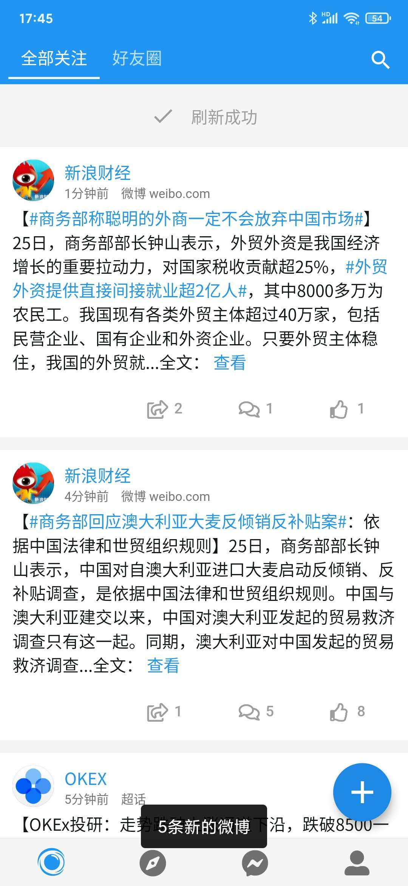
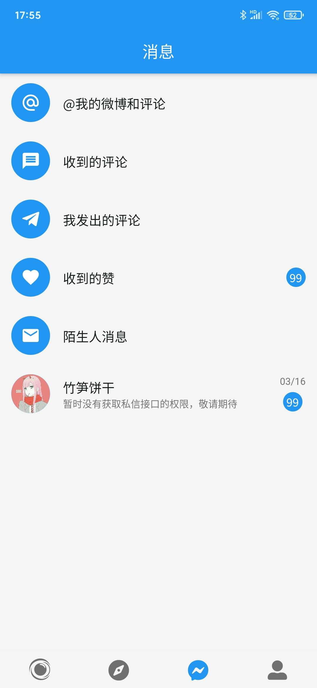
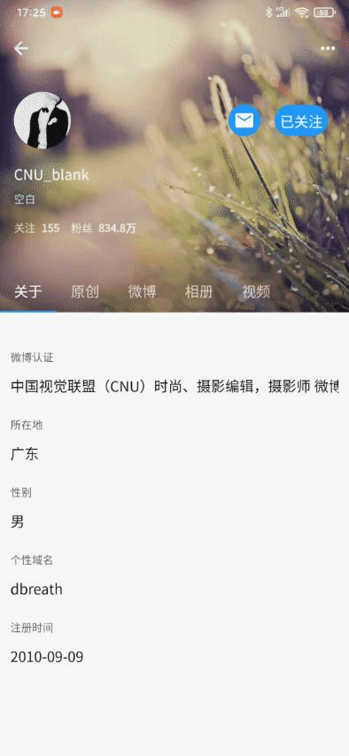
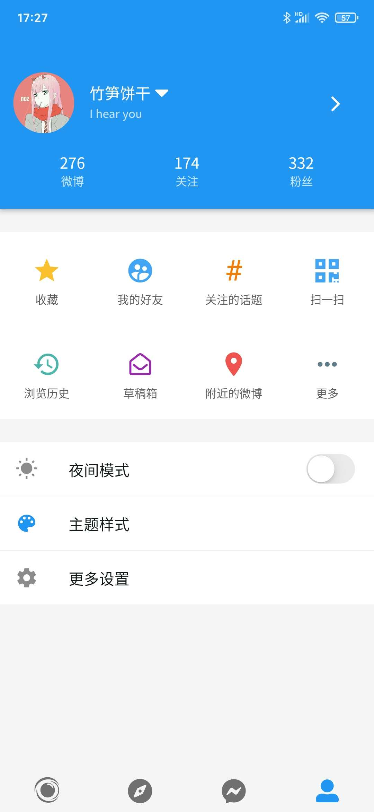
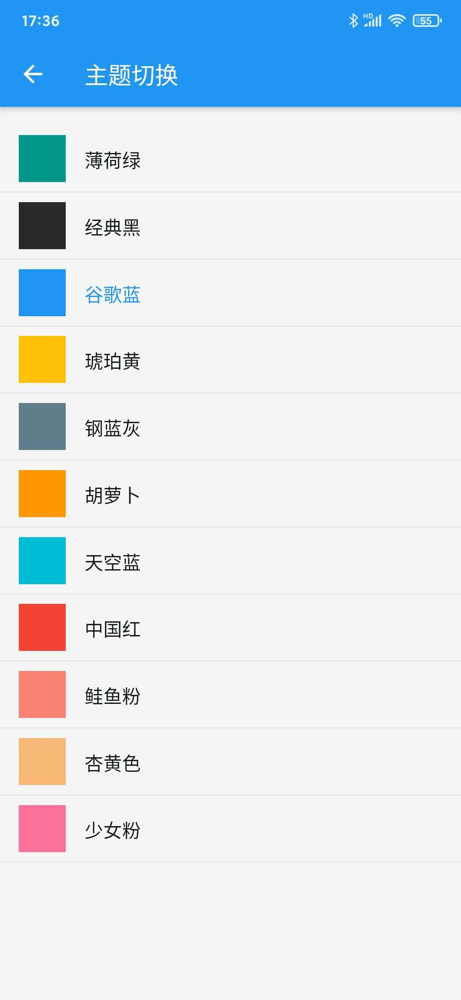

# 饼干微博 -Flutter下的微博客户端

**一个在Flutter上不断踩坑不断实践的项目**

接口使用的是**新浪开放平台**提供的API

UI是参照了**Smooth**、**Share**、**微博国际版** 以及个人喜好

**体验请点击[下载](https://www.coolapk.com/apk/268934)** (APP仍在持续开发中)


||||
|-|-|-|
||
||
||


## 编译运行

项目目前基于Flutter 1.17.1 Stable版本构建

个人如需编译运行需要申请[微博开放平台](https://open.weibo.com/apps)的App Key和App Secret，相关流程请自行查阅平台文档。

除正常的Flutter构建流程外，**获取key后需要创建`assets/data/appkey.json`文件并填写好以下信息**

``` 
{
    "appkey":"",
    "appSecret":"",
    "redirectUri":""
}
```
没有在官方申请到key的同学，可以使用`assets/data/appkey-n.json`改名`appkey.json`进行测试。


## 项目说明

本项目主要是对Flutter进行学习，在个人接触过的客户端应用开发(WinForm/Vue+Cordova)来说，Flutter构建界面体验是比较优秀的，以下是目录的一些说明，请参照项目食用。

>`action` `reducer` 用于redux的模型以及方法

>`config` 存储样式配置和一些静态配置

>`db` sql的封装

>`event` eventBus相关

>`model` 微博Json转化而来的数据模型，大部分使用[JsonToDart](https://javiercbk.github.io/json_to_dart/)生成
>>`local` 存储的是一些与本地数据或widget相关的模型

>`net` 对网络请求的封装

>`page` 用户界面
>>`public` 指多个界面都可能会跳转到的页面  
>>`widget` 对一些复用组件的封装

>`provider` 可以看作controller，包含对数据持久化的控制

>`utils` 工具类

使用的第三方框架就不一一列出了，`pubspec.yaml`文件中有相关注释

## 问题答疑

#### 1. 为什么应用中多处按钮点击无反应？
    一是人懒效率还低仍在实现中，二是新浪API不好弄，希望有相关经验的dalao可以贡献代码或指导

#### 2. 下一步的计划是
    [ ] 添加字体更换以及语言选择
    [ ] 黑暗模式跟随系统
    [ ] 适配微博定位信息到地图
    [ ] 点赞评论及写微博
    [ ] 适配微博更多内容(话题,投票等)

有其他问题请提交[issues](https://github.com/sabernwj/cookiej/issues)

特别感谢Smooth作者[@06peng](https://weibo.com/llp0524)的appkey


欢迎找我交流flutter相关

**微博**:[@竹笋饼干](https://www.weibo.com/p/1005052294516673)  
**QQ**: FlutterCandies群里搜索`竹笋饼干`或者添加好友`599123803`


    
   


